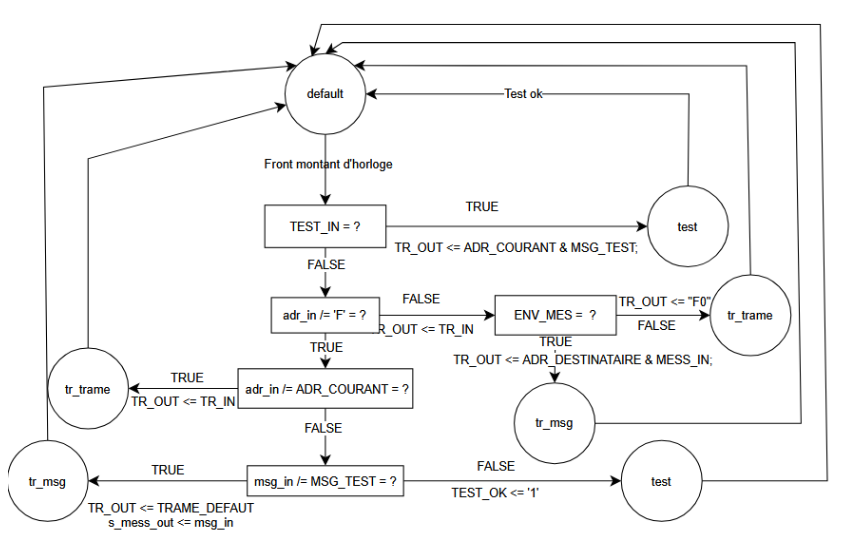
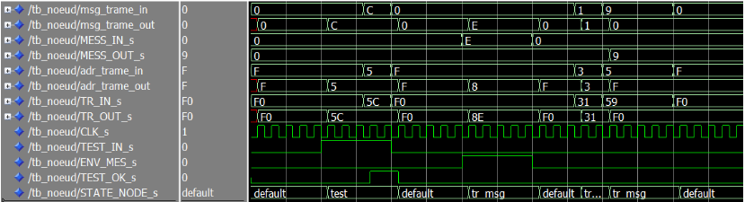
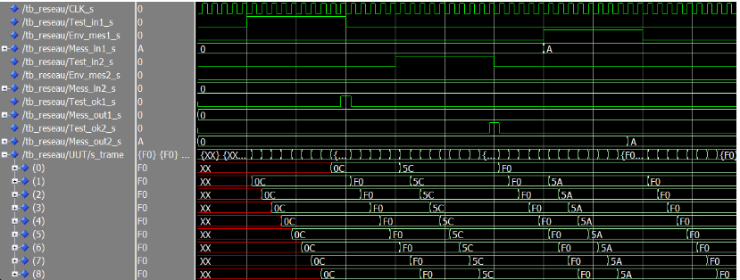

# VHDL-Ring-Network-Desig

# 🛰️ Réseau de Communication en Anneau (VHDL)

Projet de conception numérique réalisé dans le cadre de l'année universitaire 2025-2026 (**4EII**).  
Ce projet porte sur la modélisation et la simulation d'un **réseau de communication synchrone** structuré en anneau, implémenté en VHDL.

---

## 📋 Présentation du projet

L'objectif est de concevoir un système de communication par paquets entre plusieurs nœuds. Chaque nœud est capable de router des données, de s'auto-tester et de communiquer avec des destinataires spécifiques au sein d'une grille paramétrable.

### Spécifications techniques
* **Format des trames** : 8 bits (4 bits d'adresse | 4 bits de message).
* **Topologie** : Anneau fermé, structuré en grille $N \times N$ (avec $1 < N < 5$).
* **Priorité des flux** :
    1.  **Auto-test (Priorité Max)** : Envoi d'une trame de diagnostic (`0x"C"`) pour vérifier l'intégrité de l'anneau.
    2.  **Relayage** : Transmission prioritaire des trames reçues si l'adresse ne correspond pas au nœud courant.
    3.  **Réception** : Extraction du message vers `MESS_OUT` si l'adresse correspond.
    4.  **Émission locale** : Envoi de `MESS_IN` si aucune trame n'est en transit.
    5.  **Idle** : Émission d'une trame par défaut (`0xF0`) avec message "VIDE".

---

## 🏗️ Architecture du Nœud

Chaque entité `Node` est autonome et synchrone sur front montant d'horloge.


### Interface (Entrées/Sorties)
| Port | Description | Type VHDL | Direction |
| :--- | :--- | :--- | :--- |
| **CLK** | Horloge (front montant synchrone) | `std_logic` | **in** |
| **TR_IN** | Entrée des trames (8 bits) | `std_logic_vector(7 downto 0)` | **in** |
| **TR_OUT** | Sortie des trames (8 bits) | `std_logic_vector(7 downto 0)` | **out** |
| **TEST_IN** | Demande d’auto-test | `std_logic` | **in** |
| **TEST_OK** | Résultat d’auto-test | `std_logic` | **out** |
| **ENV_MES** | Demande d’envoi d’un message | `std_logic` | **in** |
| **MESS_IN** | Message à envoyer (4 bits) | `std_logic_vector(3 downto 0)` | **in** |
| **MESS_OUT** | Message réceptionné (4 bits) | `std_logic_vector(3 downto 0)` | **out** |

### Comportement d'nu noeud

---

## 🕸️ Structure du Réseau

Le réseau est généré de manière structurelle via des boucles `GENERATE`. 

* **Adressage Statique** : Les adresses courantes sont définies via une constante 2D (matrice d'adresses).
* **Destinations Symétriques** : Chaque nœud cible automatiquement la position $(N-1-i, N-1-j)$.
* **Interconnexion** : Seuls les nœuds "Haut-Gauche" et "Bas-Droite" exposent leurs interfaces de contrôle vers l'extérieur du système global.


---

## 🧪 Simulation et Validation

La validation a été effectuée sous **ModelSim** avec les scénarios suivants :

1.  **Test unitaire du Nœud** : Validation des priorités de routage (Adresse 5 vers 8). 
2.  **Test d'Auto-test** : Vérification de la boucle complète du message `0x"C"`.
3.  **Test de communication réseau** : Envoi de messages entre les nœuds d'extrémité.


> **Note :** Toutes les sorties sont synchrones pour garantir la stabilité des signaux lors du passage entre les nœuds.

---

## 🛠️ Instructions de compilation

Pour simuler le projet sous ModelSim :

1.  Créer la bibliothèque : `vlib work`
2.  Compiler les fichiers :
    ```bash
    vcom Node.vhd
    vcom Reseau.vhd
    vcom Reseau_tb.vhd
    ```
3.  Lancer la simulation :
    ```bash
    vsim Reseau_tb
    ```

---
